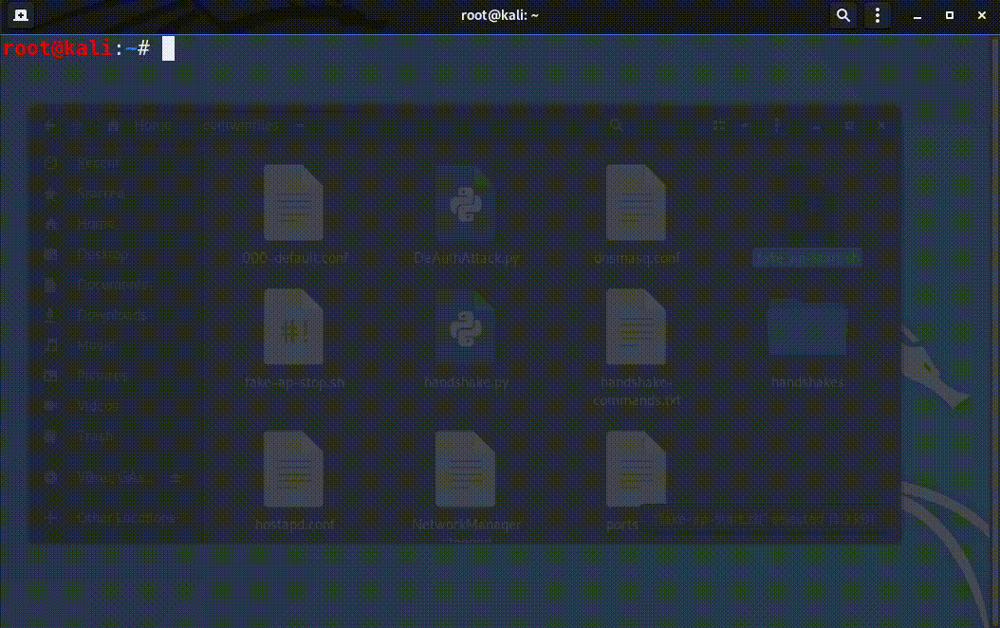

# Created by Avihu, Daniel and Din.

For educational Purposes only! we take no responsibility/liability of any kind from the use of this program.
Dont use this program on any network that isn't yours and use at your own risk.

Explaination:
For our final project in Ariel University we have created a hacking tool based on the "evil-twin attack" concept.
We choose which network we wish to impersonate to and become a third unknown party where all the traffic between clients and that network goes through us, we have complete control and can decide whether to steal information quietly without any of the sides knowing about it, or redirecting the parties to where we want, or just disconnecting them from the internet.

Hardware:
Laptop
Tenda Wireless N150 High-Power USB Adapter 
TP LINK Wn722n wifi adapter
Operation system:
Kali

Software:
Virtual box
python
scapy
dnsmasq
multiprocessing
sys
rpcbind
hostapd
apache
airmon-ng
airodump
aireplay
aircrack
bc

special problems:
we had issues with configuring wlan0 interface to monitor mode via virtualbox so we used a special set of commands for that:

iptables --flush
iptables --table nat --flush
iptables --delete-chain
iptables --table nat --deleyte-chain
iptables -P FORWARD ACCEPT

How is it done:
We first search for a network, we use airodump to find details about that network like BSSID,ESSID,Channel and such.
Then, we create an access point with the same credentials as the network that we want to attack.
We send DAuth message to disconnect any users connected to that network (their system try to automatically reconnect but instead it reconnects to our network).
We open a window on the client's side asking for the wifi password again.
We then redirect all traffic from the clients to the Network.

test:

# First step :
  git clone https://github.com/Avihuoshri/EvilTwinAttack.git
# Second step :
  start terminal in root command and execute the next command:  python DeAuthAttack.py 
  enter commands in this order:
  wlan1,
  wlan1,
  then detect the BSSID of your desired network and copy + paste it.  
  after a few seconds you should see planty of packets, press ctrl C at any time.  
  detect the client mac address copy + paste it
  2
  now wait until the specific user u decided on disconnects from the internet.
  
### - 
# Third step : 
start a new terminal and execute the command ./fake-ap-start.sh
enter SSL password: "123456" to connect to websites like google (install SSL if neccessary)

# Fourth step - 
Fifth step
Sixth step
Seventh step
Sixth step
Sixth step
  

